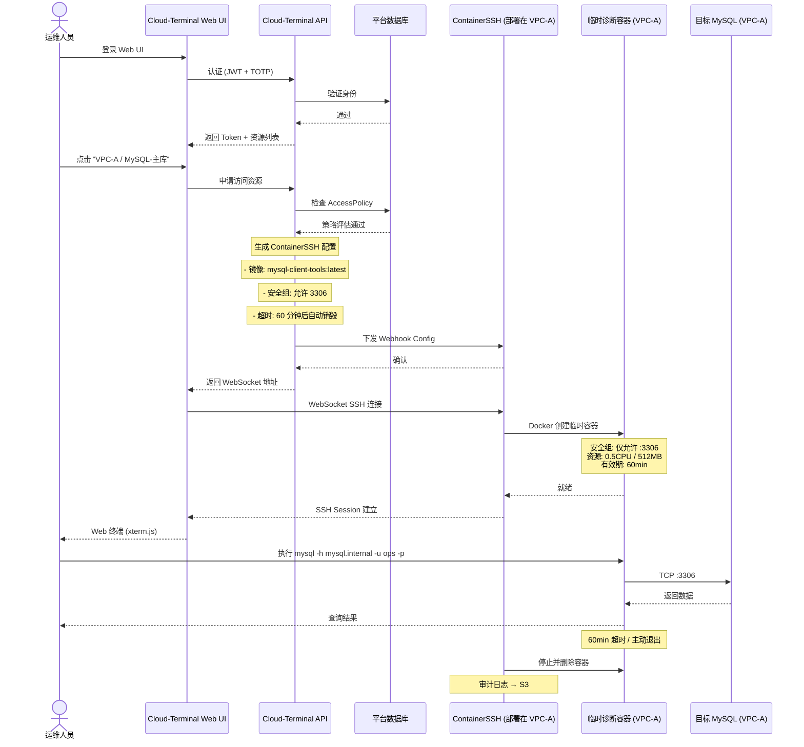
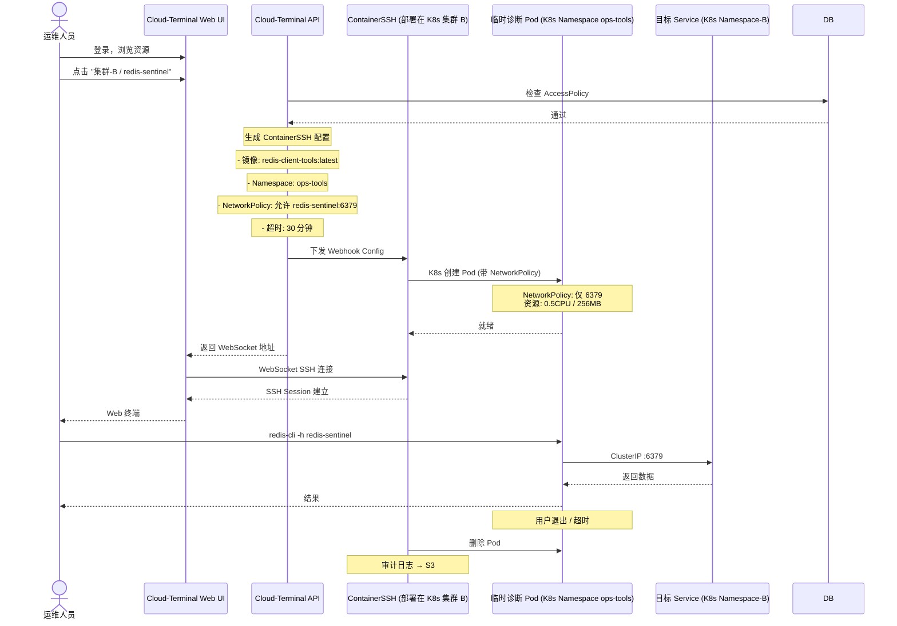
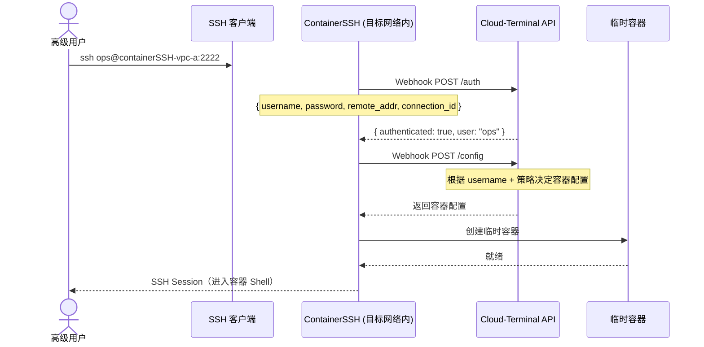
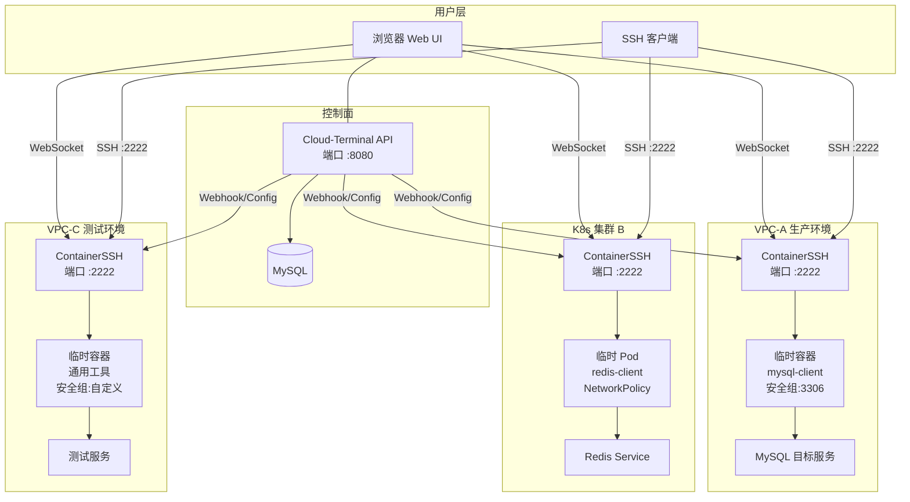
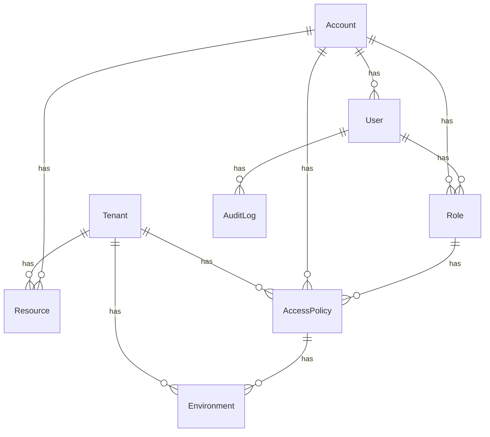

# Cloud-Terminal

> **A cloud-native access control plane that manages secure, time-bound, and auditable access to infrastructure through abstract resources instead of exposing servers directly.**
> **一个云原生基础设施访问控制平面，通过“资源”而不是服务器，为用户提供安全、临时、可审计的访问能力。**

**Approved SSH Access** — Connect to target infrastructure securely without managing static SSH keys or IP permissions. Ephemeral tokens are issued on-demand and executed inside isolated Docker container sandboxes.

我们不是传统跳板机或 CMDB，也不做 Teleport 或 JumpServer 的复刻。Cloud-Terminal 是一个面向云原生时代的 **SSH Access Control Plane（SSH 控制平面）**：让用户通过“资源 (Resource)”访问基础设施，而不暴露底层服务器 IP 与静态凭据。

---

## 架构：两层设计

| 层面 | 职责 | 技术栈 |
|:---|:---|:---|
| **控制面** | 用户管理、资源管理、权限评估、Webhook/Config 生成 | Echo API (Go) |
| **执行面** | 动态创建临时容器、执行用户操作、审计录屏 | ContainerSSH (CNCF) |

---

## 核心业务流程


### 场景一：用户通过 Web UI 访问 VPC 内 MySQL



### 场景二：用户通过 Web UI 访问 K8s 集群内 Service



### 场景三：高级用户直接 SSH（绕过 Web UI）



---

## 部署架构



---

## 为什么不是 JumpServer / Teleport / 堡垒机？

传统平台（如 JumpServer / 传统堡垒机）的思路是围绕 **Host（服务器）** 与 CMDB 展开的：
```
CMDB → Host (服务器/IP) → 授权 → 直连登录
```
用户最终还是在管理和暴露底层主机。

**Cloud-Terminal 的定位不同，核心管理对象是抽象的 `Resource`（资源）与 `Task`（工单）：**
```
Task (工单) → Approval (审批) → Policy (动态授权) → Resource (目标服务) → ContainerSSH Runtime → 临时沙箱连接
```
用户管理的是“我要完成什么工作”（如：生产数据库、Redis 运维、线上日志），系统负责鉴权、下发临时凭据、并由 ContainerSSH 作为 Runtime 启动临时微隔离沙箱建立 SSH 桥接，用完即毁。

| 维度 | 传统平台（JumpServer / 堡垒机 / Teleport） | Cloud-Terminal（SSH 控制平面 + Cloud Gateway） |
|:---|:---|:---|
| **核心对象** | **Host / IP**（物理机、虚拟机、CMDB 主机） | **Resource**（抽象业务资源：MySQL、Redis、K8s Pod 等） |
| **凭据与授权** | 静态长效 SSH 密码 / 密钥授权 | **按需动态签发（STS 临时 Token）**，零静态凭据暴露 |
| **执行 Runtime** | SSH 代理直连目标持久化主机 | **ContainerSSH 驱动隔离沙箱**，会话结束自动销毁 (`rm -f`) |
| **网络边界** | 依赖静态安全组 / Host 打通 | **微隔离网络** + JIT 单次临时连接 |
| **用户认知** | “我要登录 10.10.10.23 主机” | **“我要维护生产 MySQL-主库”** |
| **多租户体系** | 弱（通常为多部门或资产授权分组） | **原生多租户隔离体系 (Tenant-Level Isolation)** |

---

## URN 标识体系

类似 AWS ARN，使用 URN 格式统一标识所有资源：

```
urn:cloud-term:{tenant_id}:{resource_type}:{resource_id}
```

示例：
- `urn:cloud-term:tenant-a:resource:mysql-001`
- `urn:cloud-term:tenant-a:user:zhangsan`
- `urn:cloud-term:tenant-a:platform:mysql`

---

## 数据模型



| 实体 | 说明 |
|:---|:---|
| **Tenant** | 租户（组织隔离单位） |
| **Account** | 账号（凭据管理） |
| **User** | 用户（平台登录者） |
| **Role** | 角色（权限集合） |
| **Resource** | 目标服务（MySQL、Redis 等） |
| **Environment** | 容器模板（镜像、资源限制、环境变量） |
| **AccessPolicy** | IAM 策略（谁、在何时、用什么工具、访问什么资源） |
| **Session** | 会话记录（用户 → 容器 → 目标服务的完整链路） |
| **AuditLog** | 操作审计日志 |

---

## 技术栈

| 层 | 技术 |
|:---|:---|
| 后端语言 | Go |
| Web 框架 | Echo v5 |
| ORM | Ent (entgo.io) |
| 数据库 | MySQL |
| 认证 | JWT + TOTP 双因素 |
| 授权 | Casbin RBAC + IAM 策略 (AccessPolicy) |
| SSH 网关 | ContainerSSH (CNCF) |
| 审计 | Session 录像 + S3 存储 |
| 前端 | React (UmiJS) |
| 终端 | xterm.js |

---

## 项目结构

```
.
├── api/            # API 路由（登录、注册、认证等）
├── ent/            # Ent ORM 代码（自动生成）
│   └── schema/     # Schema 定义
├── handler/        # 业务逻辑处理器
├── middlewarers/   # 认证中间件
├── config/         # 配置
├── rule/           # 权限规则
├── viewer/         # 视图上下文
├── pkg/
│   └── utils/      # 工具包（JWT、密码、CSRF 等）
└── web/            # 前端
```

---

## 当前实现状态

### ✅ 已完成
- [x] Ent ORM 全部 10 个 Schema
- [x] 多租户用户认证（JWT + TOTP）
- [x] Casbin RBAC 权限模型
- [x] 访问策略引擎
- [x] 资源 / 账号 / 平台 CRUD API
- [x] 会话管理与 WebSocket 终端
- [x] 审计日志记录
- [x] 前端框架（React + UmiJS + xterm.js）

### 🚧 待实现
- [ ] Webhook + Config 生成器（Cloud-Terminal → ContainerSSH）
- [ ] 动态容器编排（根据资源类型选择镜像）
- [ ] 安全组 / NetworkPolicy 动态生成
- [ ] 容器生命周期管理（限时自动销毁）
- [ ] 操作录播回放
- [ ] 多 VPC / 多集群管理
